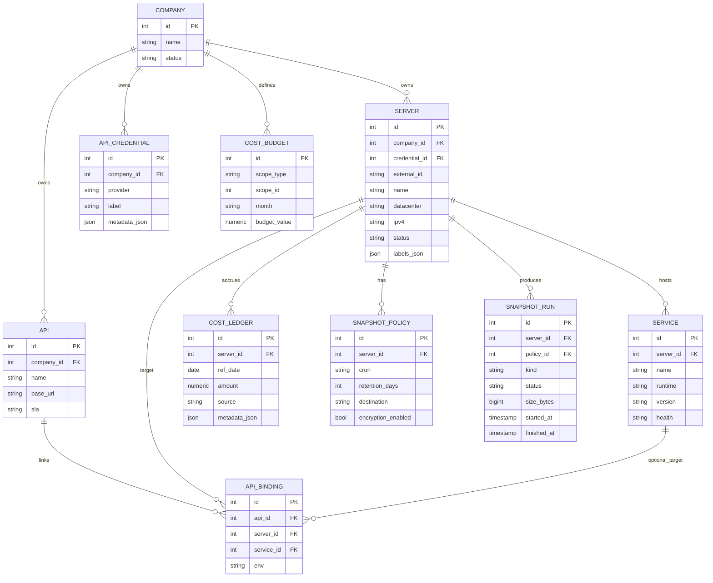

# Hestner Multi-Tenant Blueprint

## Escopo
Blueprint para evoluir o NOC em modelo multi-tenant com foco em:
- Empresa -> Servidores -> Servicos
- Empresa -> APIs -> bindings para Servidores/Servicos
- Painel operacional por servidor: indicadores, logs, eventos, custos e snapshots

## Arquitetura Alvo

### Control Plane
- `orch-ui`: painel web (gestao e operacao)
- `orch-api`: API de dominio e agregacao
- `worker`: jobs assíncronos (custos, snapshots, sincronizacao, alertas)
- `postgres`: metadados e ledger de custos
- `redis`: fila/scheduler
- `s3/minio`: artefatos e metadados de snapshot

### Data Plane (por servidor gerenciado)
- `hestner-agent`: heartbeat, inventario, operacoes seguras
- `node_exporter` + `cadvisor`: metricas host/containers
- `promtail/vector`: envio de logs para Loki
- `otel-collector` (opcional): traces para Tempo

### Observabilidade Central
- Prometheus + Alertmanager
- Loki
- Tempo (opcional)
- Grafana

## Modelo de Dados (dominio)

## Contratos de API (MVP)

### Servidores
- `GET /v1/companies/{company_id}/servers?search=&status=&env=&region=`
- `GET /v1/servers/{server_id}/overview?range=1h|24h|7d|30d`
- `GET /v1/servers/{server_id}/services`
- `PATCH /v1/servers/{server_id}` (tags, status, maintenance, credential)

### Logs
- `GET /v1/servers/{server_id}/logs?service=&q=&level=&from=&to=`
- `GET /v1/servers/{server_id}/logs/live` (SSE/WS)

### Custos
- `GET /v1/servers/{server_id}/costs?month=YYYY-MM`
- `PUT /v1/servers/{server_id}/budget`
- `GET /v1/companies/{company_id}/costs/summary?month=YYYY-MM`

### Snapshots
- `POST /v1/servers/{server_id}/snapshots` (manual)
- `GET /v1/servers/{server_id}/snapshots`
- `PUT /v1/servers/{server_id}/snapshot-policy`

### APIs vinculadas
- `GET /v1/companies/{company_id}/apis`
- `GET /v1/apis/{api_id}/topology`
- `POST /v1/api-bindings`
- `DELETE /v1/api-bindings/{binding_id}`

## Modelo de Custos

### Fontes
- Cloud billing provider (quando disponivel)
- Rate card local (VPS/bare metal)

### Calculo base
- `base_mensal_proporcional = plano_mensal / dias_no_mes`
- `variavel_cpu = cpu_hours * preco_cpu_hour`
- `variavel_ram = ram_gb_hours * preco_ram_gb_hour`
- `variavel_storage = storage_gb * preco_storage_gb_mes / dias_no_mes`
- `variavel_net = egress_gb * preco_egress_gb`

### Ledger
- Job diario grava em `cost_ledger`
- Projecao = media_dia * dias_restantes
- Alertas em 70%, 90%, 100% da meta

## Snapshots e Retencao

### Fluxo
1. Usuario dispara manual ou politica cron
2. Worker enfileira job para agent/orquestrador
3. Agent executa hook `pre_freeze`, snapshot, `post_thaw`
4. Resultado e metadados em `snapshot_runs`
5. Job de retencao remove pontos vencidos

### Campos minimos do run
- `kind`: manual | cron
- `scope`: volume | db | full
- `status`: queued | running | success | failed
- `duration_ms`, `size_bytes`, `checksum`, `artifact_url`

## Roadmap de Implementacao

### Fase 1 (ja iniciada neste repo)
- Multi-credencial Hetzner por empresa
- Vinculo credencial por servidor
- Tela server-centric com abas: Dashboard, Controles, Alertas, Logs

### Fase 2
- Entidades `service`, `api`, `api_binding`
- Topologia API -> servico -> servidor
- Logs com filtros avancados + live tail

### Fase 3
- Custos (ledger + budget + forecast)
- Tela de custos por servidor e por empresa

### Fase 4
- Snapshot policy cron + historico + retencao
- Agente dedicado com mTLS e escopo de acoes

## Requisitos de Seguranca
- RBAC por tenant e trilha de auditoria para todas as acoes criticas
- Tokens de agente com expiracao/rotacao
- Secrets em cofre/secret store
- TLS fim-a-fim e, em roadmap, mTLS para agente
