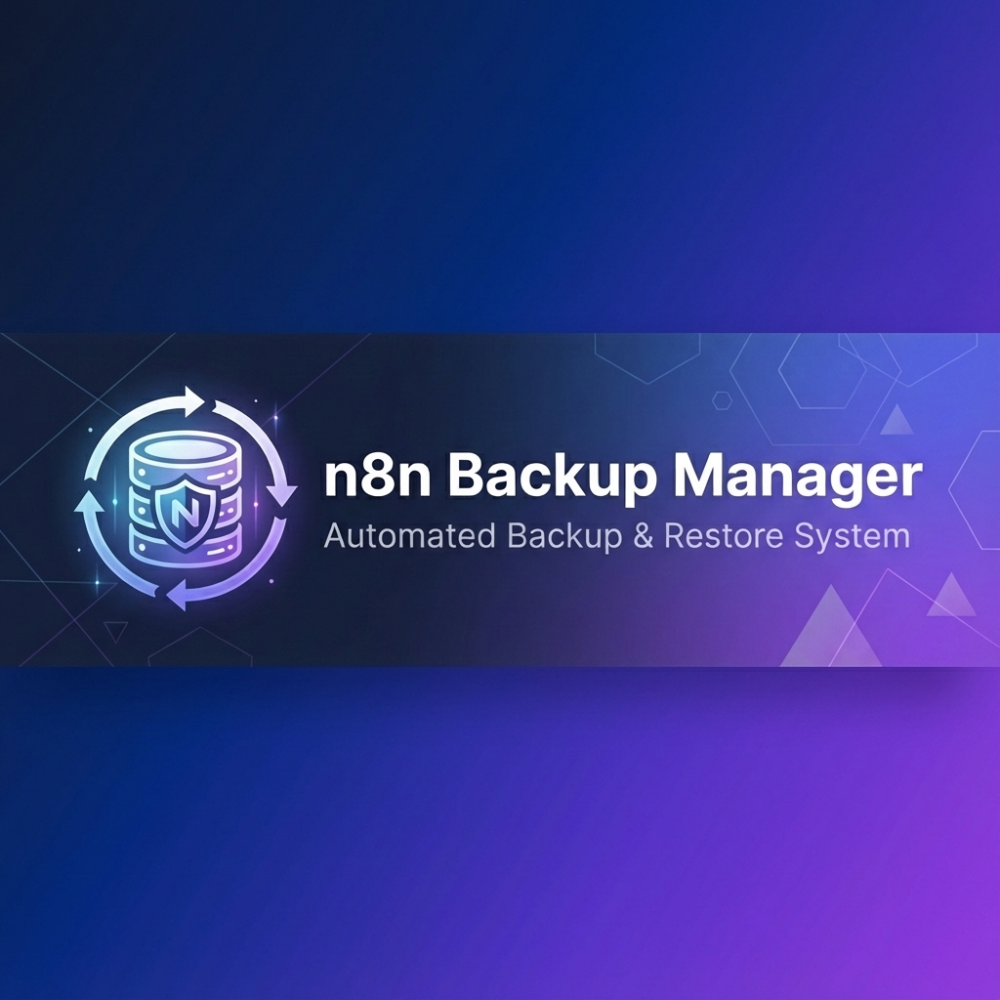
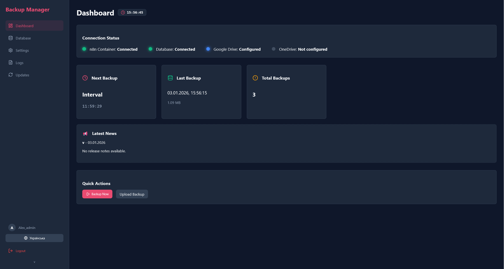
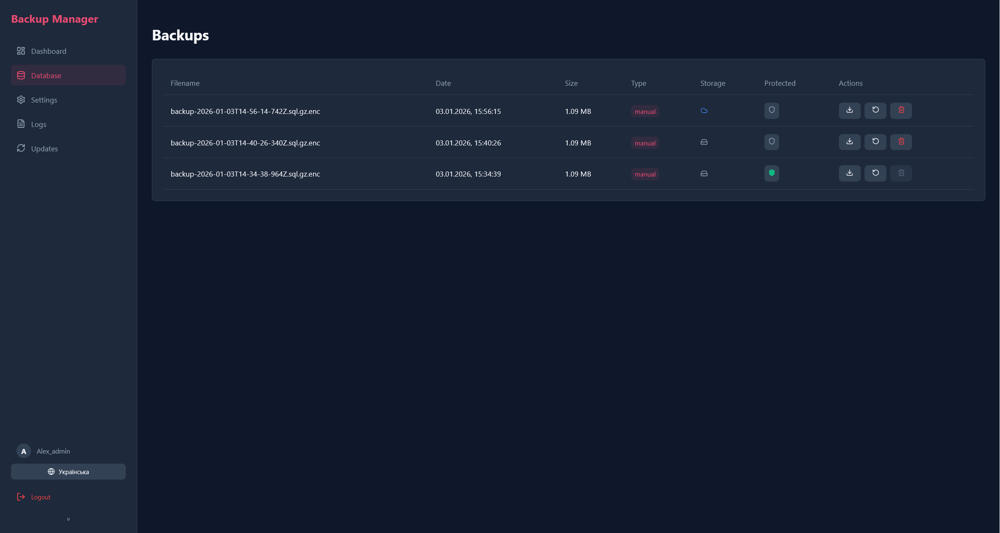
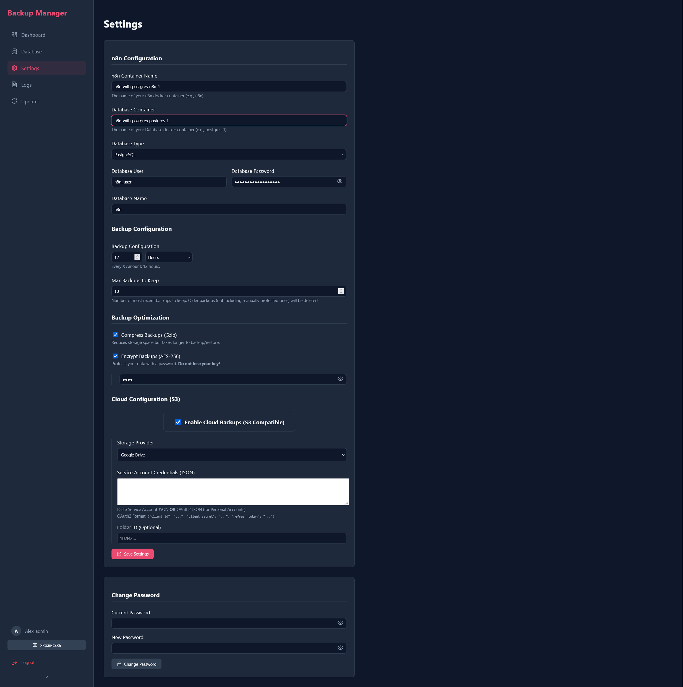
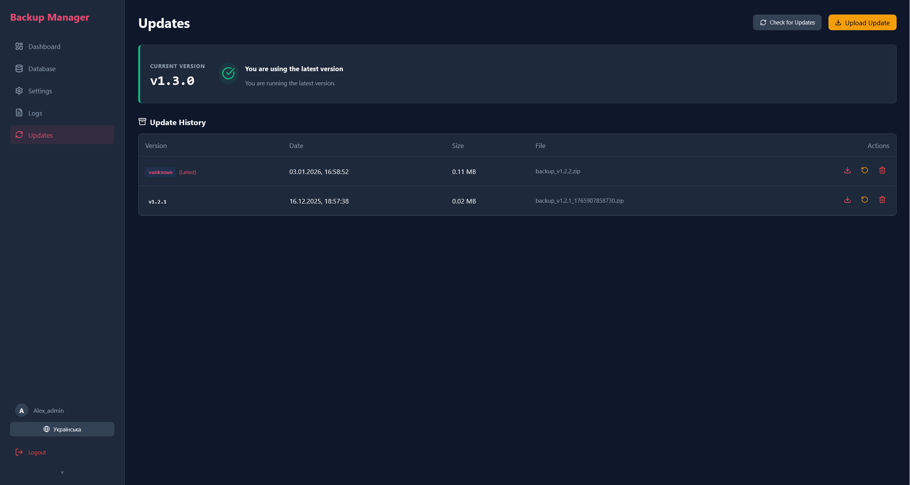
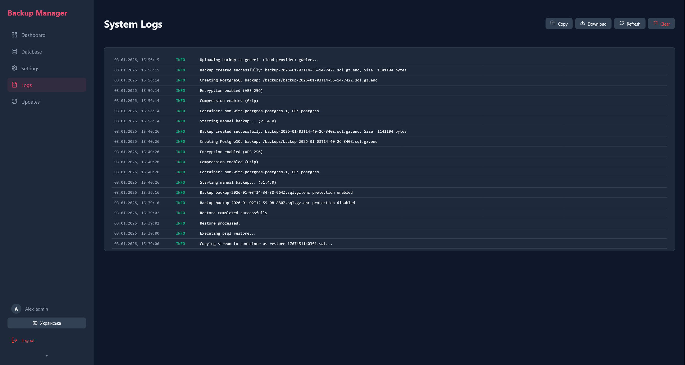

# n8n Backup Manager

<div align="center">



[](https://stand-with-ukraine.pp.ua)


**Automatic backup and restore system for n8n**

[Features](#-features) • [Installation](#-installation) • [Usage](#-usage) • [Updates](#-updates) • [Screenshots](#-screenshots) • [🇺🇦 Українська версія](README.uk.md)

### 🙏 Acknowledgements
*This section will be used to thank contributors and advisors who help improve this project.*

</div>

---

## 🚀 Features

- ✅ **Automatic Backup** of n8n workflows and database
- ✅ **PostgreSQL & SQLite Support**
- ✅ **Backup Compression** (Gzip)
- ✅ **Backup Encryption** (AES-256)
- ✅ **Cloud Backups** (S3, Google Drive, OneDrive)
- ✅ **Flexible Scheduling** (cron or intervals)
- ✅ **Backup Retention Policy** (auto-delete old backups)
- ✅ **One-Click Backup & Restore**
- ✅ **Protected Backups** (prevent auto-deletion)
- ✅ **Web Interface** for management
- ✅ **Automatic Update System** from GitHub
- ✅ **Rollback** capability
- ✅ **Connection Status Monitoring**
- ✅ **Password Management**
- ✅ **Detailed Logging**

## 📸 Screenshots

### Dashboard

*Main dashboard with system status and quick actions*

### Backups

*Backup management: view, download, restore*

### Settings

*Connection settings and backup scheduling*

### Updates

*Automatic update system from GitHub*

### Logs

*Detailed system logs*

## 📋 Requirements

- Docker & Docker Compose
- n8n running in a Docker container
- PostgreSQL or SQLite database
- Minimum 1GB free space for backups

## 🛠️ Installation

### Quick Start

1. **Download the latest release:**
   ```bash
   wget https://github.com/aleksnero/n8n-backup-manager/releases/latest/download/release.zip
   unzip release.zip
   cd n8n-backup-manager
   ```

2. **Start with Docker Compose:**
   ```bash
   docker compose up -d
   ```

> [!NOTE]
> If you are using a reverse proxy like **Nginx Proxy Manager**, ensure that this container is in the same network, or add the proxy network to the `docker-compose.yml` file. By default, the example above includes `npm_public` network.

3. **Open in Browser:**
   ```
   http://localhost:3000
   ```

4. **First Time Setup:**
   - Click "First Time Setup"
   - Create an admin account (username & password)
   - Log in

### Advanced Installation

#### 1. Clone Repository (Alternative)

```bash
git clone https://github.com/aleksnero/n8n-backup-manager.git
cd n8n-backup-manager
```

Create a `.env` file (see `.env.example`):

```env
PORT=3000
JWT_SECRET=your_secret_key_here
```

#### 3. Run

```bash
docker-compose up -d --build
```

## 📖 Usage

### Connection Settings

Go to **Settings** and configure:

**For Docker:**
- **n8n Container Name**: Name of your n8n container
- **Database Container Name**: Name of your DB container (e.g., `postgres-1`)
- **Database Type**: PostgreSQL or SQLite

**For PostgreSQL:**
- **Database User**: username
- **Database Password**: password
- **Database Name**: database name

**For SQLite:**
- **Database Path**: path to DB file (e.g., `/home/node/.n8n/database.sqlite`)

**Backup Optimization:**
- **Compression**: Enable Gzip compression to save space
- **Encryption**: Secure your backups with AES-256 (Password required)

**Cloud Configuration:**
- **Provider**: S3 Compatible, Google Drive, or Microsoft OneDrive
- **S3**: Configure endpoint, region, bucket, and keys
- **Google Drive** (via Service Account or OAuth2) JSON or **OAuth2 (Client ID, Secret, Refresh Token)**.
  > [!NOTE]
  > If you are using a personal Gmail account and see a Quota Exceeded error, use this JSON format:
  > ```json
  > {
  >   "client_id": "YOUR_ID",
  >   "client_secret": "YOUR_SECRET",
  >   "refresh_token": "YOUR_TOKEN"
  > }
  > ```
- **OneDrive**: Use Refresh Token or OAuth2 credentials

> [!TIP]
> **[View Detailed Cloud Setup Guide](CLOUD_SETUP.md)** for step-by-step instructions on Google Drive and OneDrive configuration.

**Scheduling:**
- **Backup Schedule**: select interval (hours/minutes) or cron expression
- **Max Backups to Keep**: number of recent backups to keep before auto-deletion (excluding protected ones)

### Creating Backups

**Automatic:**
- Backups are created according to the schedule.

**Manual:**
1. Go to **Dashboard** or **Backups**.
2. Click **Create Backup**.
3. Wait for completion.

### Restoring

1. Go to **Backups**.
2. Find the desired backup.
3. Click **Restore**.
4. Confirm action.
5. Wait for restoration to complete.

### Downloading

1. In **Backups**, click **Download** next to the file.
2. The file will be saved to your computer.

## 🔄 Update System

Backup Manager supports automatic updates from GitHub:

### Checking for Updates

1. Go to **Updates**.
2. Click **Check for Updates**.
3. If new version is available, you will see release notes.

### Applying Updates

1. Click **Apply Update**.
2. Confirm.
3. System will:
   - Create a backup of current version
   - Download update
   - Apply changes
   - Restart server

### Rollback

If issues occur after update:

1. Go to **Updates**.
2. Click **Rollback**.
3. System restores previous version.

## 🐳 Docker Compose

Example `docker-compose.yml`:

```yaml
```yaml
services:
  backup-manager:
    build: .
    container_name: n8n-backup-manager
    restart: unless-stopped
    ports:
      - "${PORT:-3000}:${PORT:-3000}"
    volumes:
      - /var/run/docker.sock:/var/run/docker.sock
      - ./backups:/app/backups
      - ./data:/app/data
    environment:
      - PORT=${PORT:-3000}
      - JWT_SECRET=${JWT_SECRET:-change_this_secret}
    networks:
      - default
      - npm_public

networks:
  npm_public:
    external: true
    name: nginx_proxy_manager_default
```

## 🔧 Configuration

### Environment Variables

| Variable | Description | Default |
|----------|-------------|---------|
| `JWT_SECRET` | Secret key for JWT | `secret-key` |
| `UPDATE_SERVER_URL` | URL for update checks | GitHub URL |
| `PORT` | Server port | `3000` |

### Volumes

| Volume | Description |
|--------|-------------|
| `/var/run/docker.sock` | Docker access for container management |
| `./backups` | Backup storage |
| `./data` | SQLite database |

## 📊 Tech Stack

- **Backend**: Node.js, Express
- **Frontend**: React, Vite
- **Database**: SQLite (Sequelize ORM)
- **Docker**: Dockerode
- **Scheduler**: node-cron
- **Authentication**: JWT

## 🤝 Contribution

Pull requests are welcome! For major changes, please open an issue first.

1. Fork the Project
2. Create your Feature Branch (`git checkout -b feature/AmazingFeature`)
3. Commit your Changes (`git commit -m 'Add some AmazingFeature'`)
4. Push to the Branch (`git push origin feature/AmazingFeature`)
5. Open a Pull Request

## 📝 License

MIT License - see [LICENSE](LICENSE) for details

## 💬 Discussions

Have questions or ideas? Join [GitHub Discussions](https://github.com/aleksnero/n8n-backup-manager/discussions)!

- 💡 **Ideas** - suggest new features
- ❓ **Q&A** - get help from community
- 📢 **Announcements** - stay updated
- 🎉 **Show and tell** - share how you use Backup Manager

## 🆘 Support

If you encounter issues:

1. Check [Issues](https://github.com/aleksnero/n8n-backup-manager/issues)
2. Create a new Issue with detailed description
3. Attach logs from `docker-compose logs`

## 🔗 Links

- **GitHub**: https://github.com/aleksnero/n8n-backup-manager
- **Releases**: https://github.com/aleksnero/n8n-backup-manager/releases
- **Issues**: https://github.com/aleksnero/n8n-backup-manager/issues

## 🙏 Acknowledgements

Made for the n8n community with ❤️

---

<div align="center">

**[⬆ Back to Top](#n8n-backup-manager)**

</div>
